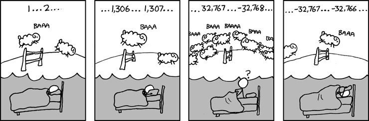
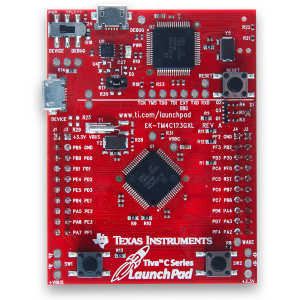
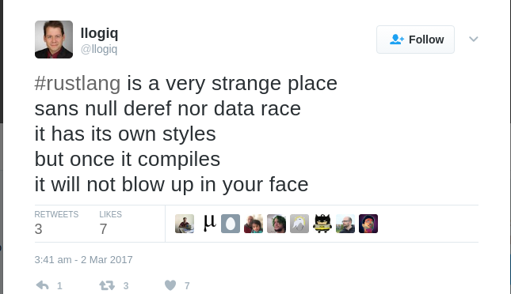

% The Rust Programming Language 
% Pramode C.E
% March 2, 2017

# 

> A language that doesn't affect the way you 
> think about programming, is not worth knowing.    
>               
>                               Alan Perlis.


# Why is Rust so exciting?

- Safe low-level systems programming

- Memory safety without garbage collection

- High-level abstractions (influenced by statically typed
  functional programming languages like ML)  without run-time overhead

- Concurrency without data races

# Why not just use C/C++?

> The second big thing each student should learn is: 
> How can I avoid being burned by C’s numerous and 
> severe shortcomings? This is a development environment 
> where only the paranoid can survive.
>
>               http://blog.regehr.org/archives/1393


# Why not just use C/C++?


# A bit of Rust history

- Started by Graydon Hoare as a personal project in 2006

- Mozilla foundation started sponsoring Rust in 2010

- Rust 1.0 released in May, 2015

- Regular six week release cycles

# Core language features

- Memory safety without garbage collection
   
    * Ownership
    * Move Semantics
    * Borrowing and lifetimes

- Static Typing with Type Inference
- Algebraic Data Types (Sum and Product types)
- Exhaustive Pattern Matching
- Trait-based generics
- Iterators
- Zero Cost Abstractions
- Concurrency without data races
- Efficient C bindings, minimal runtime

# Structure of this workshop

- Understanding the problems with C/C++
- Understanding Ownership, Borrow, Move semantics and Lifetimes
- Other features (depending on availability of time)


# The Stack

```c
// a0.c

int main()
{
    int a = 1, b = 2;
    return 0;
}
```

# The Stack

{ height=40% }

# Buffer overflow


```c
// a1.c
int main()
{
    int i=1;
    int a[4];
    int j=2;

    a[4] = 5; // bug
    a[5] = 6; // bug
    a[10000] = 7; // bug

}
```

# Buffer overflow

{ height=40% }

# Pointers in C

```c
// a2.c
int main()
{
    int a = 10;
    int *b;
    
    b = &a;
    *b = 20;
}
```

# Pointers in C

{ height=60% }

# Stack Frames - deallocations and allocations

```c
// a3.c
void fun2() { int e=5, f=6; }
void fun1() { int c=3, d=4; }

int main()
{
    int a=1, b=2;
    fun1(); fun2();
    return 0;
}
```

# Stack Frames - allocations and deallocations

{ height=60%, width=70% }

# Stack Frames - allocations and deallocations

{ height=60%, width=70% }

# Dangling Pointers

```c
// a4.c
void fun2() { int m = 1; int n = 2; }
int* fun1() { 
    int *p; int q = 0;
    p = &q; return p; // bug
}

int main() {
    int *a, b; a = fun1();
    *a = 10; fun2();
    b = *a;
}
```
# Dangling pointers

{ height=60%, width=70% }

# Null pointer dereferencing

```c
// a6.c
#include <strings.h>
#include <stdio.h>
int main()
{
    char s[100] = "hello";
    char *p;
    p = index(s, 'f');
    *p = 'a'; // bug!
    return 0;
}
```

# Heap allocation - malloc and free

```c
// a7.c
#include <stdlib.h>
void fun()
{
    char *c;
    c = malloc(10*sizeof(char));
    /* do some stuff here */
    free(c);
}
int main()
{
    fun(); 
}
```

# Heap allocation - malloc and free

{ height=40%, width=70% }

# Memory leaks

```c
// a8.c
#include <stdlib.h>
void fun()
{
    char *c;
    c = malloc(10*sizeof(char));
    /* do some stuff here */
}
int main()
{
    fun(); // bug! memory leak.
}
```
# Use-after-free

```c
// a9.c
#include <stdlib.h>
void fun(char *t) {
    /* do some stuff here */
    free(t);
}
int main() {
    char *c;
    c =  malloc(10 * sizeof(char));
    fun(c);
    c[0] = 'A'; //bug! user-after-free
}
```

# Double free

```c
// a10.c
#include <stdlib.h>
void fun(char *t) {
    /* do some stuff here */
    free(t);
}
int main() {
    char *c;
    c =  malloc(10 * sizeof(char));
    fun(c);
    free(c); //bug! double free
}
```

# Undefined behaviours and optimization

```c
// a11.c
#include <limits.h>
#include <stdio.h>
// compile the code with optimization (-O3) and without
int main() {
    int c = INT_MAX;
    if (c+1 < c) 
        printf("hello\n");
    printf("%d\n", c+1);
}
```


# Undefined behaviours

{ height=40%, width=90% }

# Undefined behaviours

> When tools like the bounds checking GCC, Purify, Valgrind, etc. first 
> showed up, it was interesting to run a random UNIX utility under them. 
> The output of the checker showed that these utility programs, despite 
> working perfectly well, executed a ton of memory safety errors such as 
> use of uninitialized 
> data, accesses beyond the ends of arrays, etc. Just running grep or 
> whatever would cause tens or hundreds of these errors to happen.

From: http://blog.regehr.org/archives/226

# Undefined behaviours

> More and more, I’m starting to wonder how safety-critical code 
> can continue being written in C.

A comment on: http://blog.regehr.org/archives/232

# Hello, world!

```rust
// a12.rs
fn main() {
    println!("hello, world!");
}

```
Compile: rustc a12.rs

Run: ./a12

# Static Typing and Type inference

```rust
// a12-1.rs
fn sqr(x: i32) -> i32 {
    let y = x * x; // type inferred
    y
}
fn main() {
    let t1 = sqr(10); // type inferred
    let t2:i32 = sqr(20);
    println!("sqr 10 = {}, sqr 20 ={}", t1, t2);
}
```
# Static Typing and Type Inference

The Rust type system is considerably more advanced than that
of "mainstream" languages like Java,C.

- https://github.com/jaheba/stuff/blob/master/communicating_intent.md

- http://ferrisellis.com/posts/rust-implementing-units-for-types/

- https://fsharpforfunandprofit.com/series/designing-with-types.html (you
   can do most of these in Rust)


# Immutability

```rust
// a12-2.rs
fn main() {
    let x = 0; // x is immutable
    let mut y = 1;
    x = x + 1; // does not work
    y = y + 1;
}
```

# Scope

```rust
// a12-3.rs
fn main() {
    let x = 10;
    {
        let y = 20;
    }
    println!("x={}, y={}", x, y);
}
```

# Ownership

```rust
// a13.rs
fn main() {
    let v = vec![10, 20, 30];
    println!("{:?}", v);   
}
// how is v deallocated?
```

# Ownership

{ height=35%, width=70% }

# Ownership

```rust
// a14.rs
fn fun1() {
    let v = vec![10 ,20 ,30];
} // how is v deallocated?
fn main() {
    fun1();
}
```
# Ownership

```rust
// a15.rs
fn main() {
    let  v1 = vec![10 ,20 ,30];
    let  v2 = v1;
    println!("{:?}", v2);
}
// do we have a double free here? 
```

# Ownership

{ height=35%, width=70% }


# Ownership

```rust
// a15-1.rs
fn fun(v2: Vec<i32>)  {
    println!("{:?}", v2);
}
fn main() {
    let  v1 = vec![10, 20, 30];
    fun(v1);
}
// do we have a double free here?
```


# Ownership

```rust
// a16.rs
fn main() {
    let  v1 = vec![10, 20, 30];
    let mut v2 = v1;
    v2.truncate(2);
    println!("{:?}", v2);
}
// what happens if we try to acces the
// vector through v1?
```


# Move semantics

```rust
// a17.rs
fn main() {
    let  v1 = vec![1,2,3];
    
    let mut v2 = v1;
    v2.truncate(2);
    println!("{:?}", v1);
}
```

# Move semantics

```rust
// a15-2.rs
fn fun(v2: Vec<i32>)  {
    println!("{:?}", v2);
}
fn main() {
    let  v1 = vec![10, 20, 30];
    fun(v1);
    println!("{:?}", v1);
}
```

# Move semantics

```rust
// a18.rs
fn main() {
    let a = (1, 2.3);
    let b = a;
    println!("{:?}", a);
}
```

# Move semantics

```rust
// a19.rs
fn main() {
    let a = (1, 2.3, vec![10,20]);
    let b = a;
    println!("{:?}", a);
}
```
# Memory safety without garbage collection

- Languages like Python, Java etc achieve memory safety
  at run time through garbage collection.

- Rust achieves memory safety at compile time by static
  type analysis. 

- Ownership + move semantics has some interesting properties
  which makes them suitable for general resource management (not
  just memory).

# Garbage Collection

```python
# a20.py
a = [10, 20, 30]
a.append(40)
print a
```
# Garbage Collection

```python
# a21.py
a = [10, 20, 30]
b = a
b.append(40)
print a # what does this print?
```

# Garbage Collection

{ height=40%, width=80% }


# Garbage Collection

{ height=40%, width=80% }


# Garbage Collection

```python
# a22.py
a = [10, 20, 30]
b = a # refcount is 2

a = "hello"  # refcount is 1
b = "world"  # refcount drops to zero, deallocate
```

# Resource management

```python
# a23.py
def read_a_line():
    f = open("/etc/passwd")
    s = f.readline()
    f.close() # close the file, release OS resources
    return s

while True:
    print read_a_line()

```
# Resource Leaks in managed languages

```python
# a24.py
def read_a_line():
    f = open("/etc/passwd")
    s = f.readline()
    # No explicit "close"
    return s

while True:
    print read_a_line()
```

# Rust means never having to close a file!

```rust
// a25.rs
use std::fs::File;
use std::io::Read;
fn read_whole_file() -> String {
    let mut s = String::new();
    let mut f = File::open("/etc/passwd").unwrap();
    f.read_to_string(&mut s).unwrap();
    s // return the string
}
fn main() {
    println!("{}", read_whole_file());
}
```
Read: http://blog.skylight.io/rust-means-never-having-to-close-a-socket/

# Ownership / Move: Limitations

```rust
// a26.rs
fn vector_sum(v: Vec<i32>) -> i32 {
    //assume v is always a 3 elemnt vector
    v[0] + v[1] + v[2]
}
fn main() {
    let v = vec![1,2,3];
    let s = vector_sum(v);
    println!("{}",s);
}
```

# Ownership / Move: Limitations

```rust
// a27.rs
fn vector_sum(v: Vec<i32>) -> i32 {
    v[0] + v[1] + v[2]
}
fn vector_product(v: Vec<i32>) -> i32 {
    v[0] * v[1] * v[2]
}
fn main() {
    let v = vec![1,2,3];
    let s = vector_sum(v);
    let p = vector_product(v);
    println!("{}",p);
}
// does this code compile?
```

# Immutable Borrow

```rust
// a28.rs
fn vector_sum(v: &Vec<i32>) -> i32 {
    v[0] + v[1] + v[2]
}
fn vector_product(v: &Vec<i32>) -> i32 {
    v[0] * v[1] * v[2]
}
fn main() {
    let  v = vec![1,2,3];
    let s = vector_sum(&v);
    let p = vector_product(&v);
    println!("v={:?}, s={}, p={}", v, s, p);
}
```

# Immutable Borrow

```rust
// a29.rs
fn main() {
    let v = vec![1,2,3];
    let t1 = &v;
    let t2 = &v;
    println!("{}, {}, {}", t1[0], t2[0], v[0]);
}
// any number of immutable borrows are ok!
```

# Immutable Borrow

```rust
// a30.rs
fn change(t1: &Vec<i32>) {
    t1[0] = 10;
}
fn main() {
    let mut v = vec![1,2,3];
    change(&v);
}
// Does the program compile?
```

# Mutable Borrow

```rust
// a31.rs
fn change(t1: &mut Vec<i32>) {
    t1[0] = 10;
}
fn main() {
    let mut v = vec![1,2,3];
    change(&mut v);
    println!("{:?}", v);
}
```

# A use-after-free bug

```c
// a32.c
#include <stdlib.h>
int main()
{
    char *p = malloc(10 * sizeof(char));
    char *q;

    q = p + 2;
    free(p);
    *q = 'A'; // bug!
    return 0;
}
```

# Vector allocation in Rust

```rust
// a33.rs
fn main() {
    let mut a = vec![];
    a.push(1); a.push(2);
    a.push(3); a.push(4);
    a.push(5);

    println!("{:?}", a);
}
```

# Vector allocation in Rust/C++

{ height=30%, width=70% }

# A use-after-free bug in C++

```cpp
// a33-1.cpp
#include <vector>
#include <iostream>
using namespace std;
int main()
{
    vector<int> v;
    int *p;
    v.push_back(1);
    p = &v[0];
    v.push_back(2);
    *p = 100; // bug!
    cout << v[0] << endl;
} 
```

# A use-after-free bug in Rust?

```rust
// a34.rs
fn main() {
    let mut v = vec![10, 20, 30, 40];
    let p1 = &v[1];
    v.push(50);
    // bug if we try to use p1
    // does this code compile?
}
```
# Borrowing Rules

- Any number of immutable borrows can co-exist.

- A mutable borrow can not co-exist with other 
  mutable or immutable borrows.

- The "borrow checker" checks violations of these
  rules at compile time.

# Borrow checker limitations

- The borrow checker gives you safety by rejecting ALL
  unsafe programs.

- But it is not perfect in the sense it rejects  safe
  programs also; "fighting the borrow checker" is a 
  common sporting activity among Rust programmers :)

- There are plans to improve the situation:
  http://smallcultfollowing.com/babysteps/blog/2017/03/01/nested-method-calls-via-two-phase-borrowing/

# Borrow checker limitations - an example

```rust
// a35.rs
fn main() {
    let mut v = vec![10,20,30];
    v.push(v.len());
}
// this will not compile
```

# Borrow checker limitations - an example

```rust
// a36.rs
// Same as a35.rs
fn main() {
    let mut v = vec![10,20,30];
    let tmp0 = &v;
    let tmp1 = &mut v;
    let tmp2 = Vec::len(tmp0); //v.len()
    
    Vec::push(tmp1, tmp2);// v.push(tmp2)
}
```

# Lifetimes

```rust
// a37.rs
fn main() {
    let ref1: &Vec<i32>;
    {
        let v = vec![1, 2, 3];
        ref1 = &v;
    }
    // v gets deallocated as it goes out of
    // the scope. What about ref1? Do we have
    // a "dangling pointer" here?
}  
```

# Lifetimes

```rust
// a38.rs
fn foo() -> Vec<i32> {
    let v = vec![1, 2, 3];
    v // transfer ownership to caller
}
fn main() {
    let p = foo();
    println!("{:?}", p);
}
```

# Lifetimes

```rust
// a39.rs
fn foo() -> &Vec<i32> {
    let v = vec![1, 2, 3];
    &v // Will this compile? 
}
fn main() {
    let p = foo();
}
```

# Explicit Lifetime Annotations

```rust
// a40.rs
fn foo(v1: &Vec<i32>, v2: &Vec<i32>) -> &i32 {
    &v1[0]
}
fn main() {
    let v1 = vec![1, 2, 3];
    let p:&i32;
    {
        let v2 = vec![4, 5, 6];
        p = foo(&v1, &v2);
        // How does the compiler know, just by looking at
        // the signature of "foo", that the reference 
        // returned  by "foo" will live as long as "p"?
    }
}
```

# Explicit Lifetime Annotations

```rust
// a41.rs
fn foo<'a, 'b>(v1: &'a Vec<i32>, 
               v2: &'b Vec<i32>) -> &'a i32 {

    &v1[0]
}
fn main() {
    let v1 = vec![1, 2, 3];
    let p:&i32;
    {
        let v2 = vec![4, 5, 6];
        p = foo(&v1, &v2);
    }
}
```

# Explicit Lifetime Annotations

```rust
// a42.rs
fn foo<'a, 'b>(v1: &'a Vec<i32>, 
               v2: &'b Vec<i32>) -> &'b i32 {
    
    &v2[0]
}
fn main() {
    let v1 = vec![1, 2, 3];
    let p:&i32;
    {
        let v2 = vec![4, 5, 6];
        p = foo(&v1, &v2);
    }
}
```

# Unsafe

```rust
// a43.rs
fn main() {
    // a is a "raw" pointer intialized to 0
    let a: *mut u32 = 0 as *mut u32;

    *a = 0;
}
```

# Unsafe

```rust
// a44.rs
fn main() {
    let a: *mut u32 = 0 as *mut u32;

    unsafe {
        *a = 0;
    }
}
```

# Rust on  microcontrollers



# Rust on  microcontrollers

```rust
// part of blinky.rs
loop {
    gpio::port_write(gpio::GPIO_PORTF_BASE, 
                     gpio::GPIO_PIN_1, 
                     gpio::GPIO_PIN_1);
    delay(500000);
    gpio::port_write(gpio::GPIO_PORTF_BASE, 
                     gpio::GPIO_PIN_1, 
                     0);
    delay(500000);
}
```

# Rust on microcontrollers

- http://pramode.in/2016/12/17/rust-on-tiva-launchpad/
- https://japaric.github.io/discovery/

# A complete web app in Rust (using rocket.rs)

```rust
#![feature(plugin)]
#![plugin(rocket_codegen)]

extern crate rocket;

#[get("/<name>")]
fn index(name: &str) -> String {
    format!("\nHello, {}!, hope you are enjoying \
           the Rust workshop!\n", name)
}
fn main() {
    rocket::ignite()
    .mount("/", routes![index])
    .launch();
}
```
# Test run the web app!

- wget -q -O  - http://128.199.100.27:8000/Mohan

- curl -s http://128.199.100.27:8000/Mohan

# End of Part 1

- What we have seen so far is the "core" of Rust, these are
  the ideas which make Rust unique! 

- Most of the other "interesting" ideas are borrowed from statically
  typed functional programming languages (like ML). (The first
  Rust compiler was written in Ocaml).


# End of Part 1




# Zero Cost Abstractions

```rust
// a45.rs
const N: u64 = 1000000000;
fn main() {
    let r = (0..N)
            .map(|x| x + 1)
            .fold(0, |sum, i| sum+i);

    println!("{}", r);
}
// Compile with optimizations enabled:
// rustc -O a45.rs
```

# Zero cost abstractions

```rust

(0 .. N) => (0, 1, 2, 3, .... N-1) # an "iterator"

(0 .. N).map(|x| x+1) => (1, 2, 3, 4 .... N)

(1, 2, 3, ... N).fold(0, |sum, i| sum + i)
  
  => ((((0 + 1) + 2) + 3) + 4) + ....

```


# Zero cost abstractions

Here is part of the assembly language code produced by the
compiler for a45.rs:

```asm
.Ltmp0:
    .cfi_def_cfa_offset 80
    movabsq $500000000500000000, %rax
    movq    %rax, (%rsp)
    leaq    (%rsp), %rax
    movq    %rax, 8(%rsp)
```

Looks like the expression has been evaluated fully at compile
time itself!

Here is the commandline used to produce the above output:

```
rustc -O a45.rs --emit=asm
```

# Zero cost abstractions

- You can write confidently using all the high-level abstractions
  the language has to offer.

- Your code will almost always be as fast as hand-coded low level C!
  

# Sum Types and Pattern Matching

```rust
// a46.rs
enum Color {
    Red,
    Green,
    Blue,
}
use Color::*;
fn main() {
    let c = Red;
    match c {
        Red => println!("color is Red!"),
        Green => println!("color is Green!"),
        Blue => println!("color is Blue!")
    }
}
```

# Sum Types and Pattern Matching

```rust
// a47.rs
#[derive(Debug)]
enum Shape {
    Circle(u32),
    Square (u32),
    Rectangle {ht: u32, wid: u32},
}
use Shape::*;
fn main() {
    let s1 = Circle(10);
    let s2 = Square(5);
    let s3 = Rectangle {ht: 10, wid: 2};

    println!("{:?}", s3);
}
```
# Pattern matching is exhaustive

```rust
// a48.rs
#[derive(Debug)]
enum Shape {
    Circle(f64),
    Square (f64),
    Rectangle {ht: f64, wid: f64},
}
use Shape::*;
fn area(s: Shape) -> f64 {
    match s {
        Circle(x) => 3.14 * x * x,
        Rectangle {ht: x, wid: y} => x * y,
    } // bug!
}
fn main() {
    let s1 = Circle(10.0);
    println!("{}", area(s1));
}
```
# The Option type

```rust
// a49.rs
fn main() {
    let mut a = vec![10];
    let b = a.pop();
    let c = a.pop();

    let d = b + 1; // does it compile?
}
```

# The Option type

```rust
// a50.rs
fn main() {
    let mut a = vec![10];
    let b = a.pop();
    let c = a.pop();

    println!("b = {:?}, c = {:?}", b, c); 
}
```

# The Option type

```rust
// a51.rs
fn main() {
    let mut a = vec![10];
    let b = a.pop();

    match b {
        Some(x) => println!("pop: {}", x),
        None => println!("empty stack"),
    }
}
```

# The Option type

```rust
// a52.rs
fn main() {
    let mut a = vec![10];
    let b = a.pop();

    println!("{}", b.unwrap());
    let c = a.pop();
    println!("{}", c.unwrap());
}
```
# Generic Enums - an implementation of Option 

```rust
// a53.rs
// A "generic" enum similar to Option
enum Maybe <T> {
    Just(T),
    Nothing,
}
use Maybe::*;
fn main() {
    let c:Maybe<i32> = Just(10);
    let d:Maybe<&str> = Just("hello");
    let e = Just(20);
    let f = Just("world");
}
```
# Generic functions

```rust
// a54.rs
fn identity <T> (x: T) -> T {
    x
}
fn main() {
    let a = identity(10);
    let b = identity('A');
    let c = identity("hello");

    println!("{}, {}, {}", a, b, c);
}
```
Rust creates specialized versions of the "identity" function
for each argument type. This is called "monomorphization".

# Product Types: Structures

```rust
// a55.rs
struct Rectangle {
    h: f64,
    w: f64,
}
impl Rectangle {
    fn area(&self) -> f64 {
        self.h * self. w
    }
}
fn main() {
    let r = Rectangle { h: 2.0, w: 3.0 };
    println!("area = {}", r.area());
}
```

# Traits 

```rust
// a56.rs
struct Rectangle {
    h: f64,
    w: f64,
}
struct Circle {
    r: f64,
}
// is "a" bigger than "b" in area?
// should work for any shape
fn is_bigger <T1, T2> (a: T1, b: T2) -> bool {
    a.area() > b.area()
}
fn main() {
    let r = Rectangle { h: 3.0, w: 2.0 };
    let c = Circle { r: 5.0 };
    println!("{}", is_bigger(r, c));
}
```

# Traits

```rust
// part of a57.rs
trait HasArea {
    fn area(&self) -> f64;
}
impl HasArea for Rectangle {
    fn area(&self) -> f64 {
        self.h * self.w
    }
}
impl HasArea for Circle {
    fn area(&self) -> f64 {
        3.14 * self.r * self.r
    }
}
fn is_bigger <T1:HasArea, T2:HasArea> 
            (a: T1, b: T2) -> bool {
    a.area() > b.area()
}
```

# Tools

- Cargo, the package manager (crates.io holds packages)
- rustfmt, formatting Rust code according to style guidelines
- clippy, a "lint" tool for Rust
- rustup (https://www.rustup.rs/), the Rust toolchain installer/manager

# Interesting projects using Rust

- Servo, from Mozilla. The next-gen browser engine.
- Redox OS (https://www.redox-os.org/), an Operating System 
  being written from scratch in Rust.
- ripgrep (https://github.com/BurntSushi/ripgrep), a fast text search
  tool.
- rocket.rs - a powerful web framework.
- More: https://github.com/kud1ing/awesome-rust

# Companies using Rust
 
- Friends of Rust: https://www.rust-lang.org/vi-VN/friends.html

# Documentation

- Official Rust book (http://rust-lang.github.io/book/). The second edition
  is far better, even though it is incomplete.

- Upcoming O'Reilly book: http://shop.oreilly.com/product/0636920040385.do

- http://intorust.com/ (screencasts for learning Rust)


